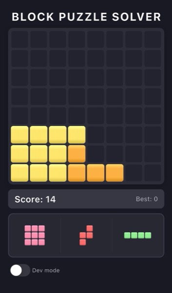
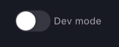
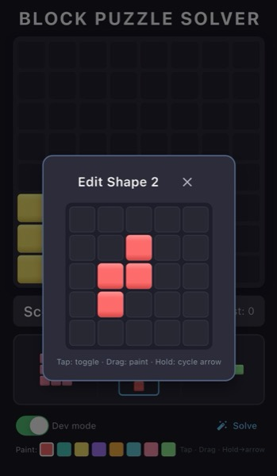
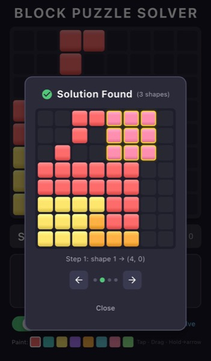

# Block Puzzle Solver

A simple Flutter block puzzle game with a built-in solver.

Users can play the game normally, or enable **Dev Mode** to edit the board and available blocks, then use the solver to check whether a valid solution exists.



## Features

- Simple grid-based block puzzle game
- Normal gameplay mode
- Dev Mode for editing the board and available blocks
- One-click solver to find an existing solution
- Built with Flutter
- Uses Provider for state management

## How to Use

### 1. Play Normally

Open the app and play the block puzzle game by placing the available blocks on the board.

### 2. Enable Dev Mode (OPTIONAL)

Tap the **Dev Mode** button at the bottom-left of the screen.



### 3. Edit the Board or Available Blocks (OPTIONAL)

Dev Mode keeps the same board view, but allows you to manually edit the board and the available blocks.

You can use this to recreate another puzzle state.

You can edit the board by:

- tapping a cell to toggle it
- dragging across multiple cells to toggle several cells in one touch



### 4. Run the Solver

Tap **Solve** to check whether a valid solution exists.

If a solution is found, the app shows the solution step by step.



## Dependencies

Main dependencies:

```yaml
flutter:
  sdk: flutter
provider: ^6.1.5+1
```

Development dependencies:

```yaml
flutter_test:
  sdk: flutter
flutter_lints: ^3.0.0
```

## Installation

Make sure Flutter is installed:

```bash
flutter doctor
```

Clone the repository:

```bash
git clone https://github.com/YOUR_USERNAME/block_puzzle_solver.git
cd block_puzzle_solver
```

Install dependencies:

```bash
flutter pub get
```

## Run the App

Run on an emulator or connected phone in debug mode:

```bash
flutter run
```

Run on a connected phone in release mode:

```bash
flutter run --release
```

To check connected devices:

```bash
flutter devices
```

## Build

Build an Android APK:

```bash
flutter build apk
```

Build an Android App Bundle:

```bash
flutter build appbundle
```

## License

This project is licensed under the MIT License. See the `LICENSE` file for details.

## Disclaimer

This project is an independent block puzzle game and solver.

It is not affiliated with, endorsed by, or sponsored by Block Blast or any related publisher.